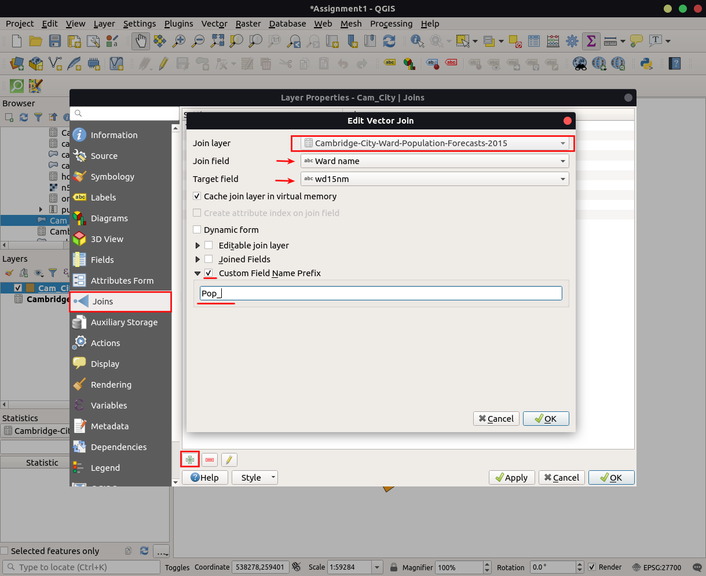
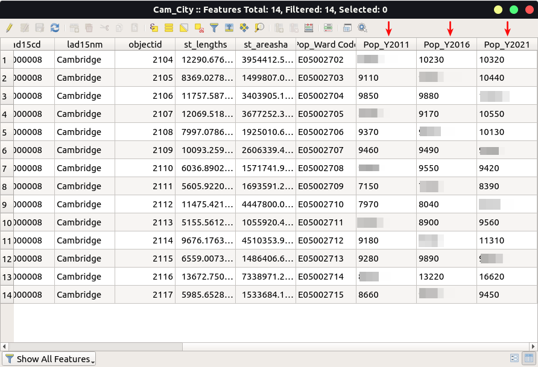
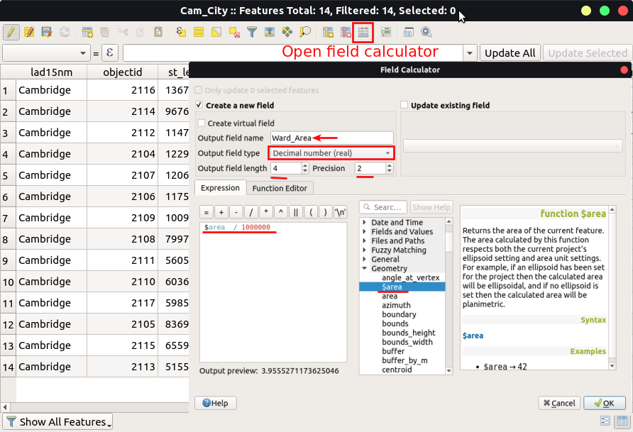
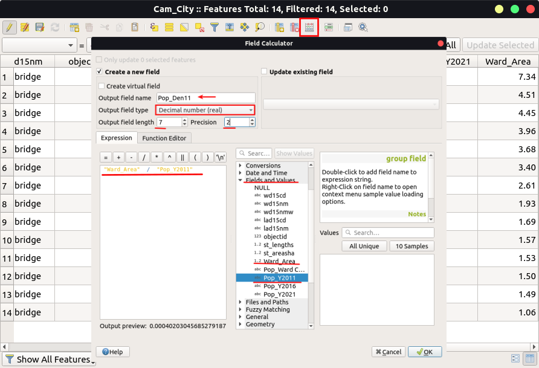

<button class="btn js-toggle-dark-mode">Dark color scheme</button>

# Assignment for Supervision 1
**Submission Dealine: 20 Feb(Thursday) 12:00pm, 2020**

## Instructions
1. Please download and install QGIS standalone install version according to your platform: [Download QGIS](https://qgis.org/en/site/forusers/download.html){:target="_blank"}
2. Read through the tasks carefully. You may face problems if you overlook any of the steps.
3. Remember to save the QGIS document regularly. 
4. Read through the instruction carefully. You may face problems if you overlook any of the steps.
5. Please write your answers in a new blank word document and submit on Moodle.   
Note: functions and filename are `highlighted` in this document.

## Assignment overview
In this assignment, you will extract the wards in the Cambridge city area using the Cambridgeshire data. After that, you will link the population data to the respective wards, and compute the population density of each ward. Lastly, you will symbolize population density in Cambridge.

## Tasks
1. Download `Cambridge District Wards` data of Cambridgeshire from [Cambridgeshire Insight Open Data](https://data.cambridgeshireinsight.org.uk/dataset/wardselectoral-divisions/resource/a5da0436-1142-48a9-8d82-d070fae138aa){:target="_blank"} and import the shapefile into QGIS.
Hint: set up project properties including `CRS`.

2. By using `Select features` or `Select features using an expression` to create a new shapefile for the wards of Cambridge City. This shapefile will include these wards: Abbey, Arbury, Castle, Cherry Hinton, Coleridge, East Chesterton, King's Hedges, Market, Newnham, Petersfield, Queen Edith's, Romsey, Trumpington and West Chesterton. Name this file as `Cam_City.shp` with choosing CRS EPSG:27700. 
Hint: Use `Select features` or `Selection using expression` command to export the data to a new shapefile. 

3. Download Cambridge population estimates data(2015) from: [2015-based population forecasts for Cambridge](https://data.cambridgeshireinsight.org.uk/dataset/2015-based-population-and-dwelling-stock-forecasts-cambridgeshire-and-peterborough-0){:target="_blank"}

4. Open it in excel and comprise only one sheet, containing five columns, Ward Code, Ward name, Y2011, Y2016 and Y2021. 

5. Import the CSV file into QGIS.
Hint: drag file into qgis or add csv through `Data Source Manager`.

**Question A: Which ward has the highest and lowest population in 2011, 2016 and 2021? Tabulate and also write respective population.**

6. Right-click the `Cam_City` and click the `Properties` option. Switch to the `Joins` section on the side and click the `Add` button to join the population table `2015-based population forecasts for Cambridge` to the `Cam_City` shapefile. Select `Ward name` as Join field and `wd15nm` as Target field. Once this is done, the Attribute Table of `Cam_City` shapefile should show the Ward name and the population of each ward in 2011, 2016 and 2021. 

7. Use the `Export` command to create a new shapefile, name it as `Cam_City_Pop.shp`. The Attribute Table of this shapefile must be showing the ward names as well as the corresponding population in 2011, 2016 and 2021. 

8. In the Attribute Table of `Cam_City_Pop` shapefile, click `Open field calculator`. Create a new field named as `Ward_Area` and set the output field type to ‘Decimal number (real)’, Precision = 4 and Scale = 2. In the expression window, input `$area/1000000` and it will compute the area for each ward in km2 (sq kilometres). 
Note: you can find `$area` in the right list under `Geometry` section.  

**Question B: Why did we use `Decimal number` as the data type while adding the field `Ward_Area` in the Attribute Table of `Cam_City_Pop` shapefile? What is the purpose of setting the `Field langth` and `Precision` values?**

**Question C: Which ward is the largest and smallest in terms of area? Also note their areas in km2.**

9. In the Attribute Table of `Cam_City_Pop` shapefile, click `Open field calculator`. Create another new field named as `Pop_Den11` and set the output field type to ‘Decimal number (real)’, Precision = 7 and Scale = 2. In the expression window, input `Pop_Y2011/Ward_Area` and We will compute population density, number of population per km2 in each ward. Repeat this step to create `Pop_Den16` and `Pop_Den21`, and calculate density for 2016 and 2021.  

**Question D: Which ward has the highest and lowest population densities in 2011, 2016 and 2021? Tabulate and also write respective population densities.**

10.Symbolised cambridge map in `Categorized color` by `Pop_Den21` (per km2) of 2021 and export the map. 
Hint: nevigate to `Project` > `Import/Export` > `Export Map to Image` in menu bar and set `Extent` by `Calculate from layer`(Cam_City_Pop)`. Please insert the exported image into your assginment. 

