---
output:
  pdf_document:
    latex_engine: xelatex
    highlight: haddock
layout: default
nav_order: 2
title: Supervision 1
mainfont: Arial
---

<button class="btn js-toggle-dark-mode">Dark color scheme</button>

# Supervision 1 (12-13 February, 2020)

## Instructions
1. Read through the instruction carefully. You may face problems if you overlook any of the steps.
2. Remember to save the QGIS document regularly. 
3. When running tasks on QGIS, leave the settings as default unless instructed. 
Note: functions and filename are `highlighted` in this document.

## Supervision overview
In this exercise, you will familialise youself with basic features of QGIS software and geoprocessing exercises with vector data and raster data.

### Setup Work Enviornment (10 mins)
1. Please download and install `QGIS standalone install version` according to your platform: [QGIS Download Page](https://qgis.org/en/site/forusers/download.html){: .btn }{:target="_blank"}. 
2. It is suggested to create a folder and name it as `rm03_YourCRSid_sup1`, at your prefered directory on your disk. This folder will be the working directory for all datasets and QGIS project file in this supervision.
3. Launch QGIS: Start QGIS Desktop and check interface (menu bar, toolbar, brower panel, layer panerl and map window) 
Note: if some panels or toolbars are not showing, nevigate to menu bar  `View` > `Panels` or `Toolbars` to switch on. 

### QGIS Project Setup (5 mins)
1. Create new project: In the QGIS – Map view window, click `New`.
2. Save your project: Click `Project` button in `Project Toolbar` and save as `supervision1.QGZ` to the working directory. 
3. Go to `Project` >  `Properties` from menu bar and open the `Project Properties` window. Check following tabs and edit: 
    - `General` tab: in the general settings, set your working directory as `Project Home`, change the unit for distance measurement you prefer and also display coordinates units.
    - `Metadata` tab: It is suggested to input title, author, creation date and a short abstract in the identification tab.
    - `CRS` tab: this tab provide coordinate reference system (CRS) setting for the project file. Be aware that CRS setting in the `Project Properties` is just for the project (called as `Data Frame setting` in ArcGIS). CRS setting for layers will be introduced later. 
Note: after adding project home, you can find `Project Home` directory is showing in the `Browser panel`. It is much easier to locate your data files through this panel. 

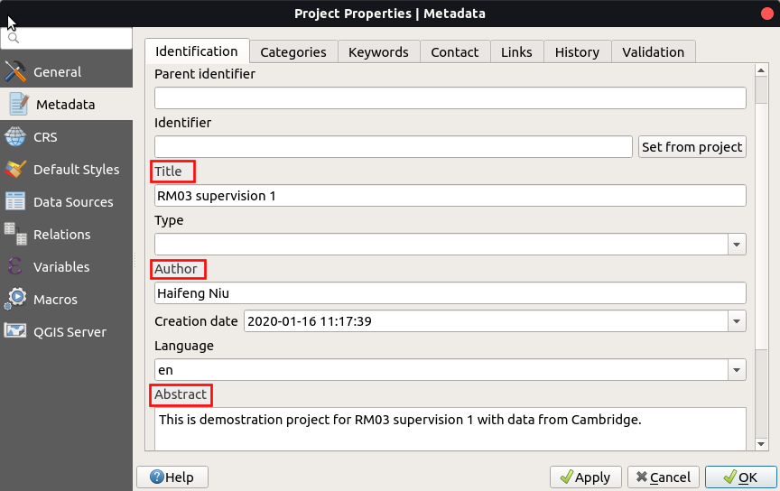
 

### Vector Data (30 mins)
- How to import shapefile into QGIS?
- How to activate a layer?

1. Download `Cambridge District Wards` data of Cambridgeshire from: [Cambridgeshire Insight Open Data](https://data.cambridgeshireinsight.org.uk/dataset/wardselectoral-divisions/resource/a5da0436-1142-48a9-8d82-d070fae138aa){: .btn }{:target="_blank"} and save zip file into your working directory.
2. Import shapefile into your project:  Locate this file at your working directory through `Browser Panel` and hold the left mouse and drag the `Wards_December_2015_Generalised_Clipped_Boundaries_in_Great_Britain.shp` into the map window. Or, you can add vector file through data source manager. 
Note: You may be prompted a window to conduct CRS transformation, click ok to continue. 

3: Layer ticked then can be found in `Layer Panel`. You can turn on and off layer by ticking it or not. Before you perform any action to a layer, please make sure the target layer is ticked and selected with hightlight.

#### Attributes table
- How to open attribute table?
- How to select ploygons only from cambridge through attribute tbale?

1. Select layer in layers penel, click the `open attribute table` in the `Attribut Toolbar`. You will see the attribute table with different fields including `wd15nm` (name for Ward District) and `lad12nm` (name for Local Authority District). 

2. In the attribute table of Cambridgeshire layer and double-click `lad12nm` to sort by value/content. Select all rows whose `lad12nm` value equals `cambridge` (select first one and then press SHIFT on your keyboard while selecting the last one). 
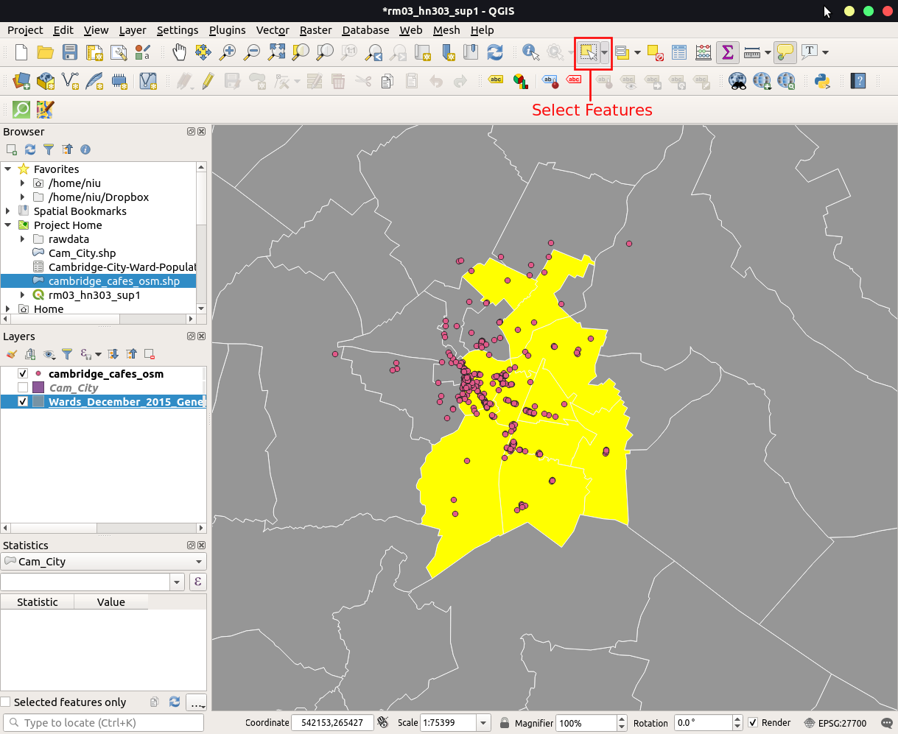

3.  Here is an alternative method to select elements precisely: Open attribute table of Cambridgeshire layer and `Select features using an expression` in QGIS. In the window of expression, input `"lad15nm" = 'Cambridge'` and click select features.  
Note: You don't need to type expression manually, expand `Field and Values` option in the right panel and  double click `lad15nm`. The field name will show in the expression window. Once you select the field `lad15nm`, click `All Unique` button on the right, it will show a list of unique values from the field of `lad15nm`. Double click it to finish the expression. 
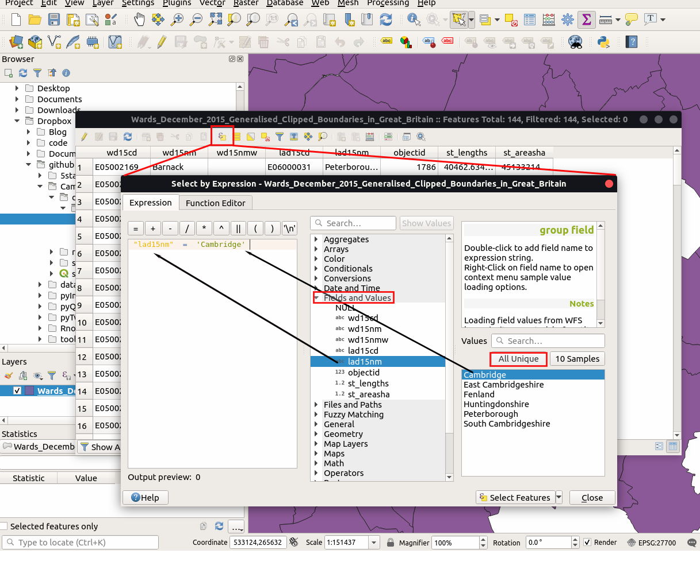

4. Once select elements you need, right-click this layer and nevigative to `Export` > `Save Selected Features As`. Name this file as `Cam_City.shp`. This shapefile will include these wards: Abbey, Arbury, Castle, Cherry Hinton, Coleridge, East Chesterton, King’s Hedges, Market, Newnham, Petersfield, Queen Edith’s, Romsey, Trumpington and West Chesterton. 

5. Check other functions in attribute table: `select all`, `invert selection`, `deselect all`

#### Importing spreadsheets or CSV files
- How to import data from spreadsheets and CSV with coordinates?
- How to display coordinates from spreadsheets and CSV in QGIS?

1. Download `Cambridge local services` data of Cambridgeshire from: [Cambridgeshire Insight Open Data](https://data.cambridgeshireinsight.org.uk/dataset/cambridge-local-services/resource/af2c41d1-c8a0-46cf-ab77-ca407732e060){:target="_blank"} and save into your working directory. This is a set of data to be used to geo-locate a short list of agencies and facilities around Cambridge.
2. Nevigate to menu bar click `Layer` > `Add Layer` > `Add Delimited Text Layer`. Browse the `cambridge-services-geolocated-csv-2-standardized.csv` just dowloaded and change the layer name to `Cam_Services`. In the section of File Format, choose CSV. In the Geometry Definition section, choose `Point coordinates` and select `Longitude` and `Latitude` fields as X Y fields respectively. Normally the Geometry definition secction will be auto-populated if it finds a suitable X and Y coordinate fields. Then choose the right CRS (EPSG: 4277 - OSGB 1936) for this file. Finally, click add and you will find a point layer. 

#### Join layer
- How can we link cambridge local services with district information?

1. Nevigate to `Processing` > `Toolbox` and search `Join  attributes by location`. In the prompted window, choose `Cam_Services` as input layer and `Cam_City` as join layer. In the geometric predicate stection, choose `intersects`. In the join type section, choose `create seperate feature for each located feature (one-to-many)`. 
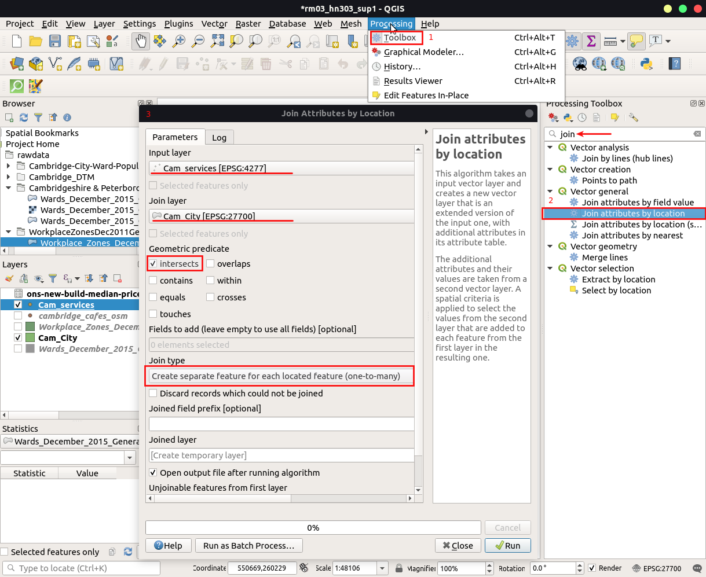

2. Check attribute table of `Joined layer` and you will find district information for each service item.

### Digitizing Map Data (15 mins)
- How to install a plugin in QGIS?
- How to add basemap to QGIS?
- How to create a new shapefile?
- How to add new features with attributes?

#### Basemap and plugins in QGIS

1. Extend functions of your QGIS with plugins: open `Plugins` > `Manage and Install Plugins` from menu bar. Search `QuickMapServices` and click `Install plugin`.  
Note: if some plugins are not showing, please switch to `Setting tab` and trun on the `Show also experimental plugins` option. 
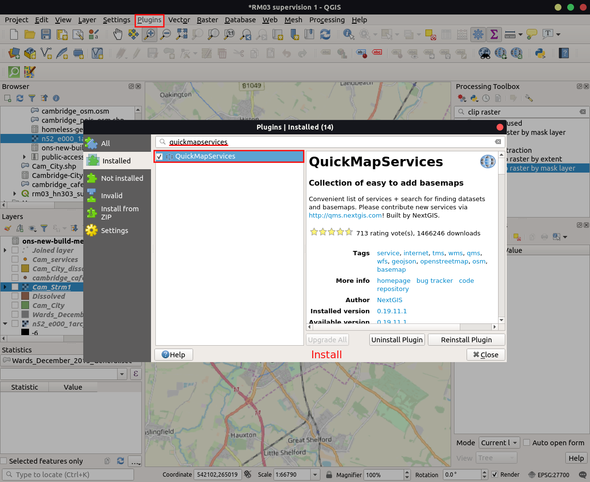

2. After installing the plugin, you can find `QuickMapServices` function in the `Web` section from menu bar. Choose `OSM`-`OSM Standard` and you will add basemap in QGIS.

#### Create features/shapefiles in QGIS
1.  Once you add basemap for your QGIS project, you will see a scalable map in the map window. 
Note: You computer must be connected to the internet to add basemap as the imagery is fetched from web servers.
2.  Zoom in to the Cambridge area to find the location of your frequently visited services including cafe, restaurant, book shop, cash machines, etc. 
3.  Create the following three shapefiles using `Layer` > `Create Layer` > `New Shapefile Layer`. Name the file as `My_POI.shp`(Point). Remember to choose the `EPSG:27700 - OSGB 1936 / British National Grid` coordinate system (select CRS > filter > Search `OSGB 1936`).  You will add two `New Fields` (`name` and `category`) to its `Fields List` to store the name  and  category of each POI. 

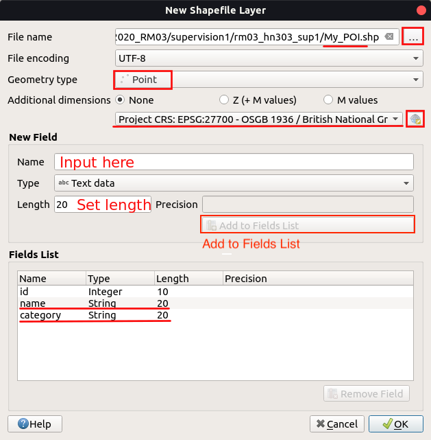

4. Select the `My_POI` layer in layer penel, then open `Toggle editing` and select `Add Point Feature`. After pin a point feature on map winodw, a `Feature Attribute` window will pop up. Input id, name and category (cafe, resturant, book shops, etc.) of this new feature.  

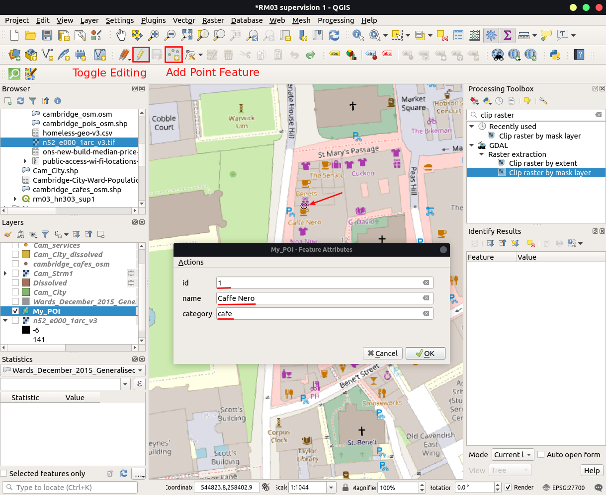

5. After creating features in map window, click `Toggle Editing` again and save changes.

6. Repeat above step from 4 to 5. Create another 4 points with inputing attributes.

### Raster Data (15 mins)
- How to import raster data?
- How to extract part of raster in Cambridge?
- How to symbolise raster map?

1. Download `Cambridge SRTM1` data of Cambridgeshire from: [Cambridge SRTM1 Data](data/n52_e000_1arc_v3.tif){:target="_blank"} into your working directory.

2. Import shapefile into your project:  Locate this file at your working directory through `Browser Panel` and hold the left mouse and drag the `n52_e000_1arc_v3.tif` into the map window. Or, you can add vector file through data source manager. 
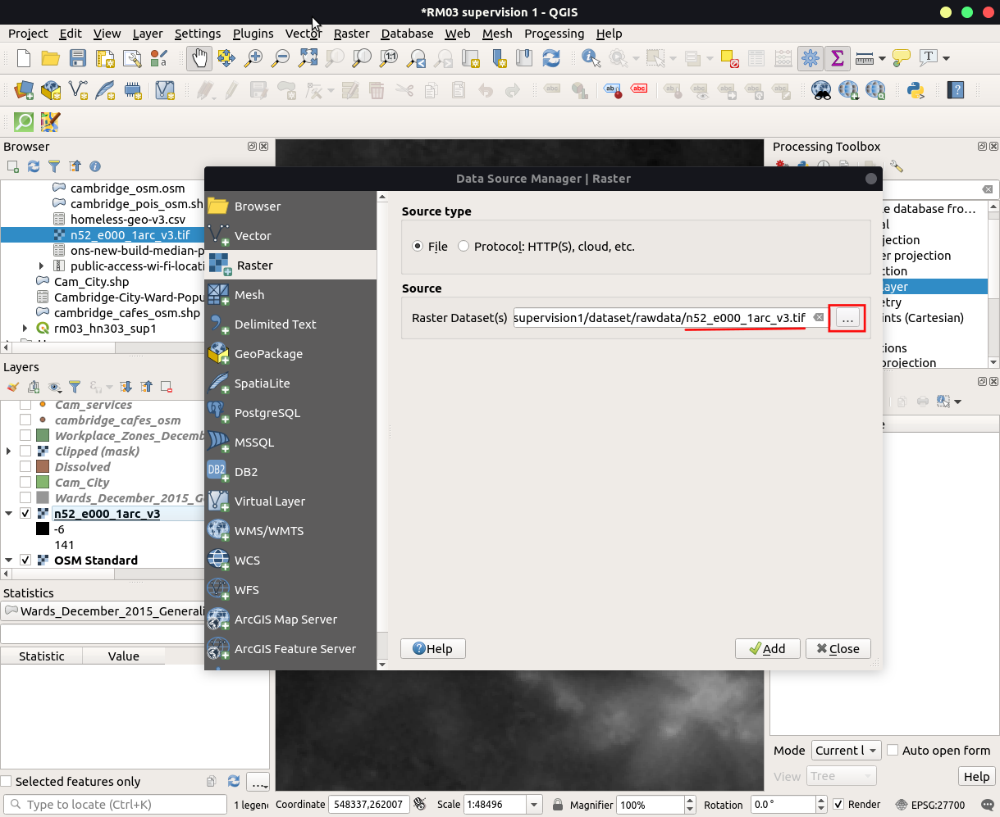

3. Before extracting from raster, we need a aggragated shapefile covering whole cambridge city. Nevigate to `Processing` > `Toolbox` and search `Dissolve` under `Vector geometry` section. In the prompted window, choose `Cam_City` as input layer and save as `Cam_City_dissolved.shp` to your working directory. 

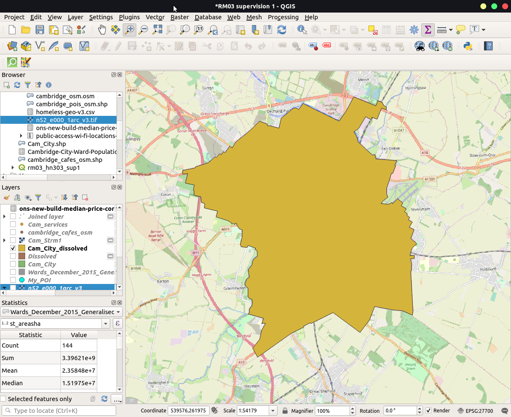

4. Nevigate to `Processing` > `Toolbox` and search `Clip`. In the prompted window, choose `n52_e000_1arc_v3` as input layer and `Cam_City_dissolved` as mask layer. Save extracted raster as `Cam_Strm1.tif`. 
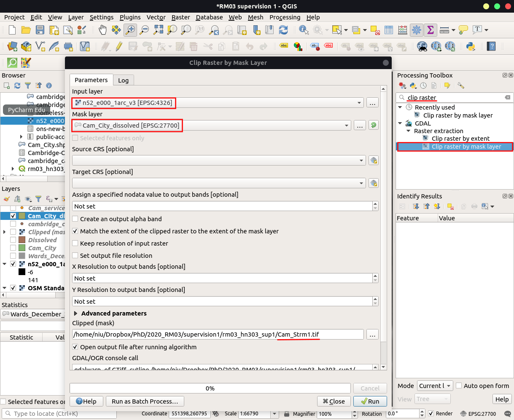

5. Change sympology: Select `Cam_Strm1.tif` and right-click to the properties option. Switch to `Symbology` tab and change `Render type` to `Paletted/Unique values`. Expand `Color ramp` section and choose `Spectral` . Then click `Classify` button to automaticlly assign color to each value. Back to `Color ramp` section and tick `Invert Color Ramp` option.  
Note: if your layer is not showing, change order of layers in `Layer Panel`. 
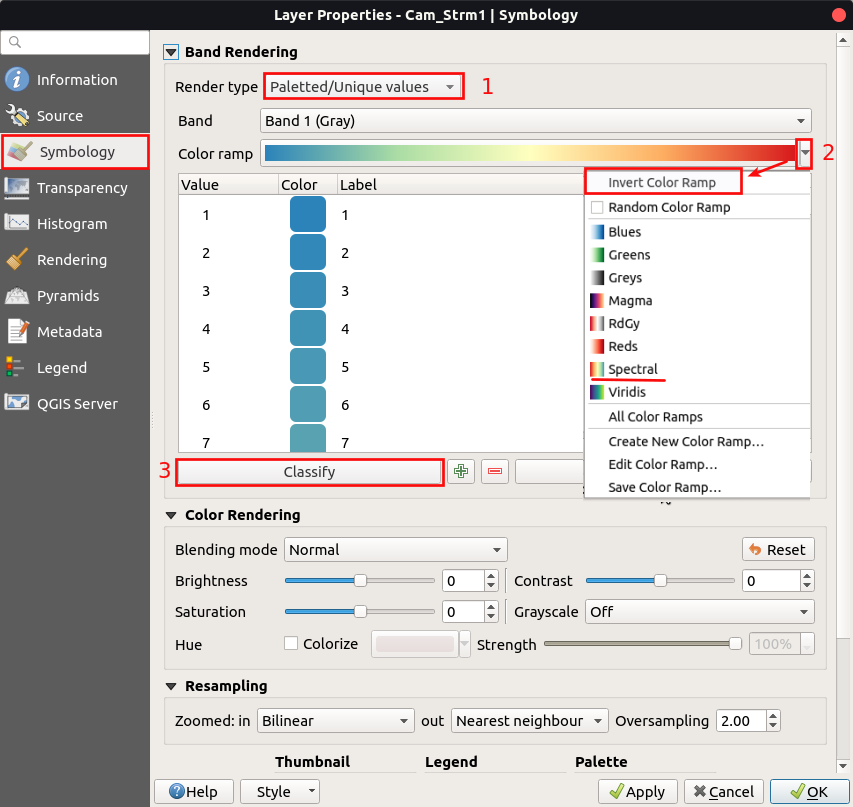
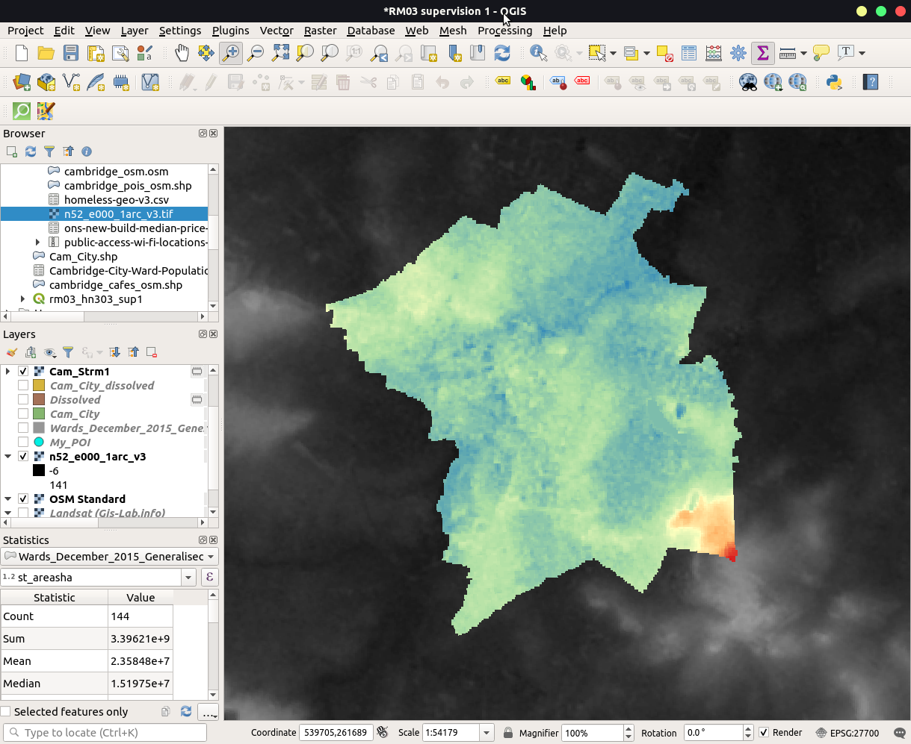

6. Check your raster map with [Camrbidge Terrain Map](https://en-gb.topographic-map.com/maps/dgf/Cambridge/)
