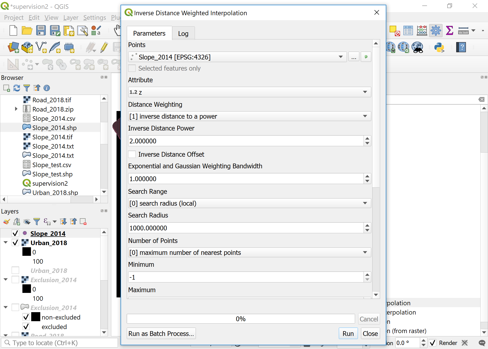
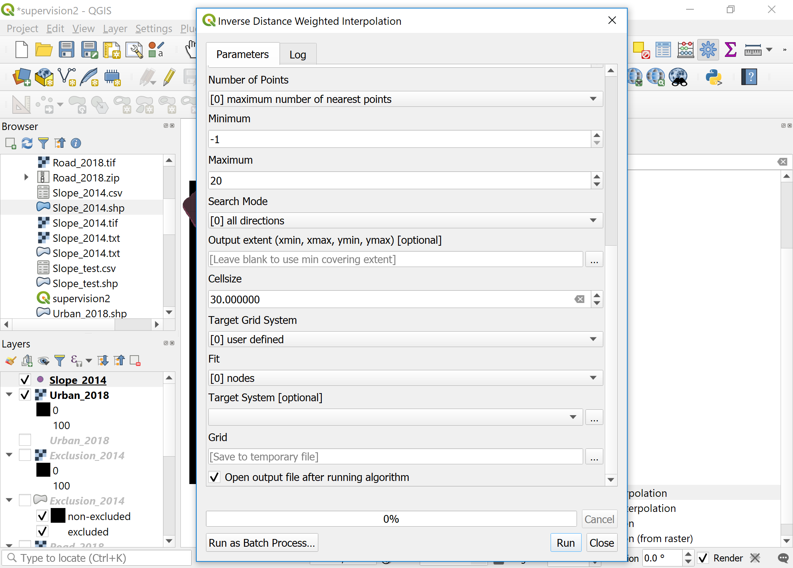
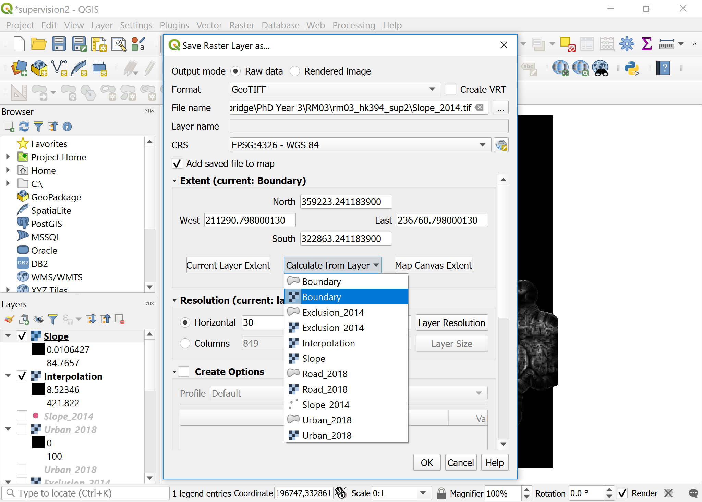

# Supervision 2

## Short presentation by supervisors (10min)
1. The slides are available on: [CamLandEc-RM03](https://hn303.github.io/CamLandEc-RM03/).

## Instructions
1. This supervision builds on Supervision 2 Assignment. If you haven't completed this for some reason, please open [Supervision 2 Assignment](https://hn303.github.io/CamLandEc-RM03/supervision2-assignment_.md) and ask for one of the supervisors' help. Additional to the four `zip` files to be downloaded for the assignment, please download the [outcomes of the assignment](data/supervision2_for_assignment_catchup.zip), and put them all unzipped in the same folder `rm03_YourCRSid_sup2` at your prefered directory on your disk.
2. Read through the instruction carefully. You may face problems if you overlook any of the steps.
3. Remember to save the QGIS document regularly. 
4. When running tasks on QGIS, leave the settings as default unless instructed.

Note: functions and filename are `highlighted` in this document.

## Supervision overview
In this supervision, you will familiarise yourself with geoprocessing raster data on QGIS software (e.g. preparing a slope map from digital elevation model (DEM) in xyz) as well as basic features of NetLogo software and how to use the GIS extension to input raster maps. 

### Resuming the QGIS exercise (20min)
1. Open `supervision2.qgz` file in your working directory `rm03_YourCRSid_sup2`.
2. Download data (sample data of Sejong, South Korea) [Slope_2014.csv](data/Slope_2014.csv) in the working directory.

#### Importing DEM data in `csv` as delimited text layer
1. On the `Menu bar`, click `Layer` > `Add Layer` > `Add Delimited Text Layer`. Add `Slope_2014.csv` with  `Point coordinates`. 

2. Right-click on `Slope_2014` layer (this is a temporary layer) > `Export` > `Save Feature As`. Set `File name`as `Slope_2014.shp` > `OK`. Remove the other temporary `Slope_2014` layer. Note: You can check the file type of the layers by lingering the cursor on the layer name, or by right-clicking > `Properties` > `Information tab`.

#### Interpolating the DEM data
4. On the `Menu bar`, click `Processing` > `Toolbox`, search `interpolation`, and double-click `Inverse distance weighted interpolation` under `SAGA`. Note: `IDW interpolation` under `QGIS Interpolation` in the `Processing Toolbox` does a similar job but takes much longer so we used a SAGA tool instead.

5. Set `Attribute` as `z` and `Cellsize` as `30`, and click `Run`.

#### Generating slope in percent from interpolated data
5. Click the newly created temporary layer `Grid`. On the `Menu bar`, click `Raster` > `Analysis` > `Slope`. Check `Slope expressed as percent instead of degrees` and click `Run` > `Close`.

6. Right-click on `Slope` layer (this is a temporary layer) > `Export` > `Save As`. Set `File name` as `Slope_2014.tif`, click `Calculate from Layer` and choose any of the four raster layers created previously (`Boundary`, `Exclusion_2014`, `Road_2018`, and `Urban_2018`). You will notice that the extent is same in all these layers. Check that `Resolution` is set as `30`. Click `OK`.

#### Converting file format from `.tif` to `.asc` (to load on NetLogo)
1. Click on `Slope_2014.tif` layer. On the `Menu bar`, click `Raster` > `Conversion` > `Translate`. Under `Converted`, click `Save to File` and save as `Slope_2014.asc`.
2. Check and click on `Urban_2018.tif` layer and uncheck all other layers. On the `Menu bar`, click `Raster` > `Conversion` > `Translate`. Under `Converted`, click `Save to File` and save as `Urban_2018.asc`.
3. Check and click on `Exclusion_2014.tif` layer and uncheck all other layers. On the `Menu bar`, click `Raster` > `Conversion` > `Translate`. Under `Converted`, click `Save to File` and save as `Exclusion_2014.asc`.
4. Check and click on `Road_2018.tif` layer and uncheck all other layers. On the `Menu bar`, click `Raster` > `Conversion` > `Translate`. Under `Converted`, click `Save to File` and save as `Road_2018.asc`.
5. Check and click on `Boundary.tif` layer and uncheck all other layers. On the `Menu bar`, click `Raster` > `Conversion` > `Translate`. Under `Converted`, click `Save to File` and save as `Boundary.asc`.
6. Check in your working directory that we have the five `asc` files. We are now ready to import them to NetLogo!

### Setup work environment for NetLogo (5min)
1. Please download and install `NetLogo (6.1.1)` according to your platform. We recommend downloading `Windows (64-bit)`, `Mac OS X`, or `Linux (64-bit)`: [NetLogo Download Page](https://ccl.northwestern.edu/netlogo/6.1.1/). 
2. Continue using `rm03_YourCRSid_sup2` as your working directory.
3. Launch NetLogo. The interface will be explained along with exercises. Note: You can refer to [NetLogo User Manual (6.1.1)](https://ccl.northwestern.edu/netlogo/docs/) for more detailed information.
4. In `File` > `Models Library`, you can find a collection of sample models to explore. There are many sample models available on the User Community Models web page.

### Exercise 1: Wolf Sheep Predation (5min)
1. Open `Wolf Sheep Predation` from `Models Library` under `Biology` folder.

2. Click `setup` > `go` to start the simulation, and click `go` agin to stop the simulation.
3. Try running the model with following changes and explain what happens:
- Change the `model-version` to `sheep-wolves-grass`.
- Decrese wolf poplulation.
- What other sliders/switches can you adjust to help out the sheep population?
- Can you find any parameters that generate a stable ecosystem?

### Exercise 2: Game of Life (10min)
1. Open `Life` from `Models Library` under `Computer Science` > `Cellular Automata`.
2. Game of Life is a simple cellular automata (CA) model where the state of the cells change according to behavioral rules. As the simulation runs, you can find recurring shapes like gliders and blinkers. Note: You can refer to [Conway's Game of Life](https://en.wikipedia.org/wiki/Conway%27s_Game_of_Life) for more detailed information.
3. Click `setup-random` > `go-forever` to start the simulation, and click `go-forever` again to stop the simulation.
