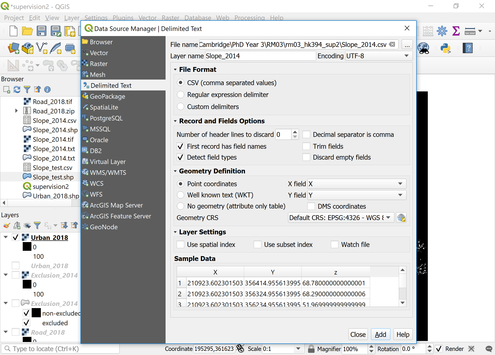
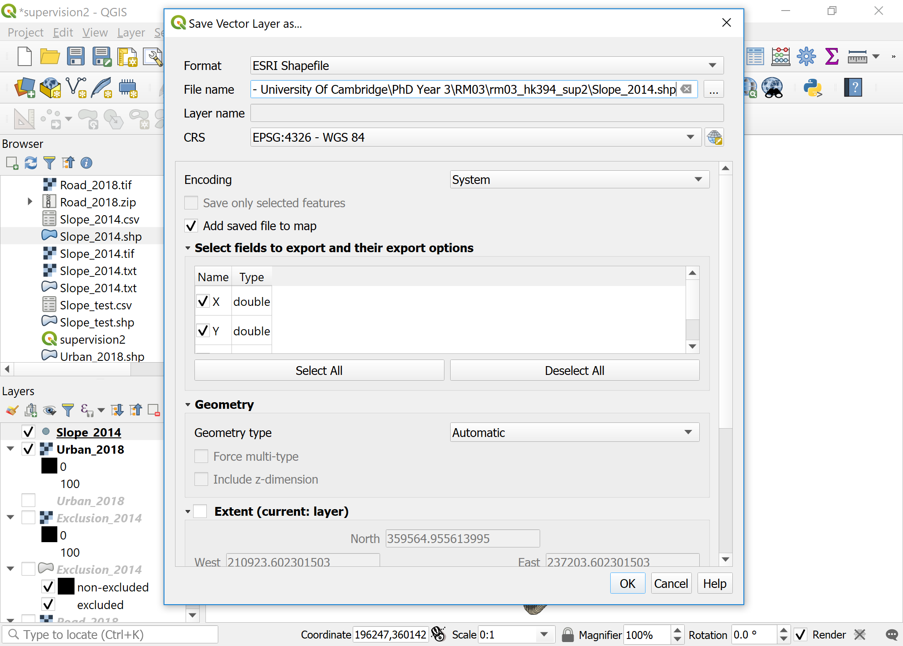
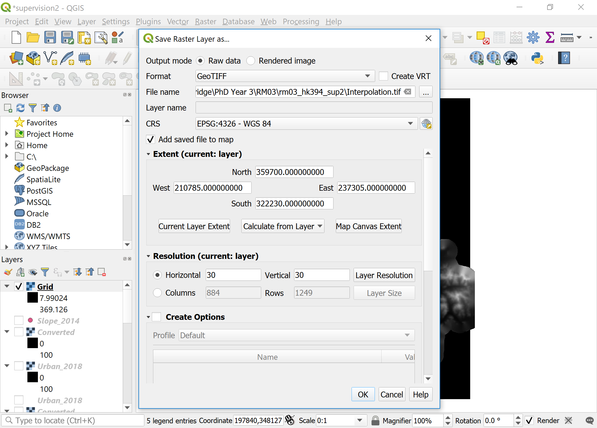
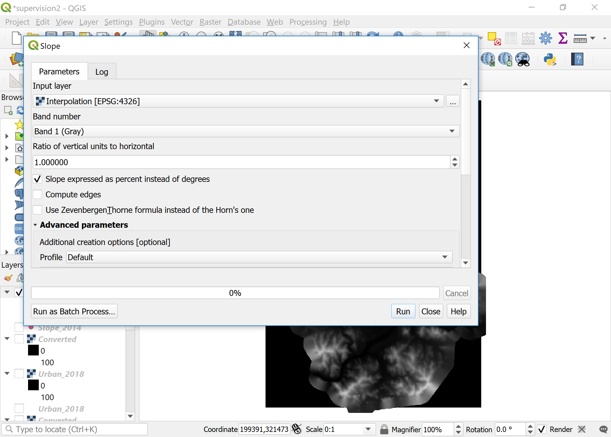
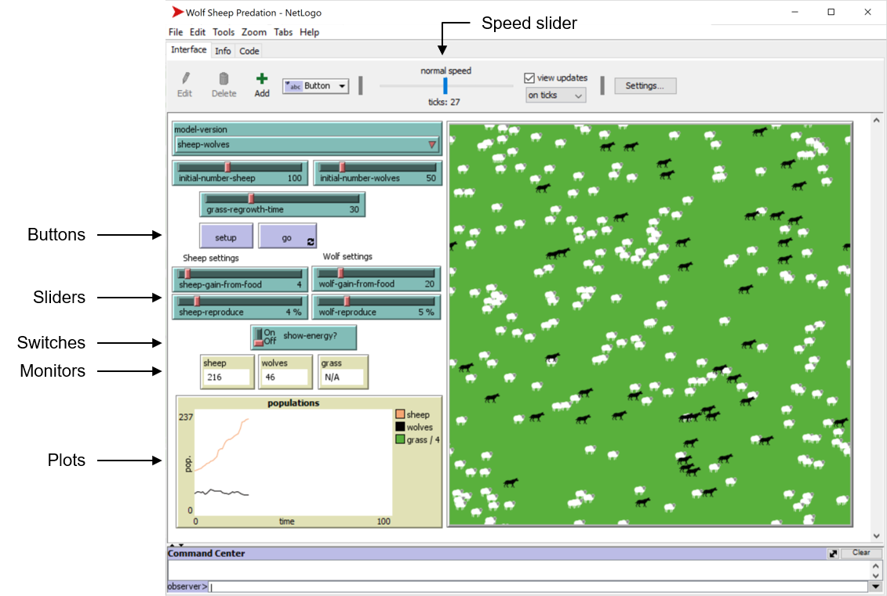
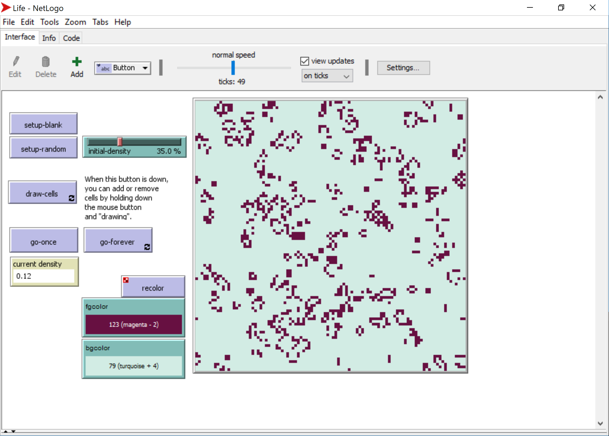
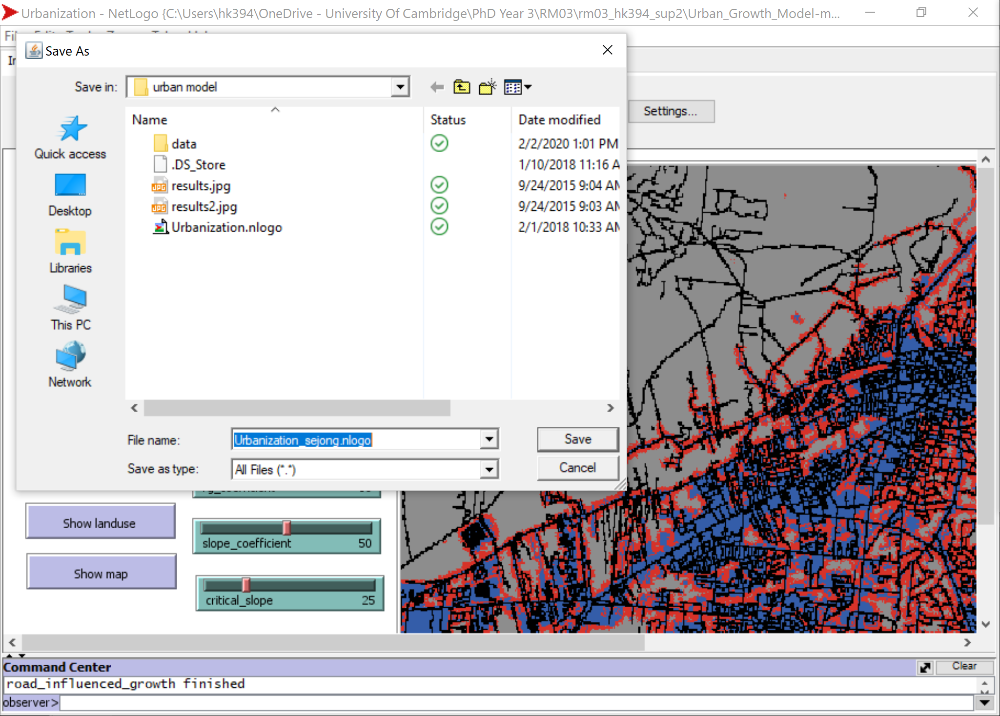

# Supervision 2 (27-28 February, 2020)

## Short presentation by supervisors (10min)
1. The slides are available on: [CamLandEc-RM03](https://hn303.github.io/CamLandEc-RM03/).

## Instructions
1. This supervision builds on Supervision 2 Assignment. If you haven't completed this for some reason, please open [Supervision 2 Assignment](https://hn303.github.io/CamLandEc-RM03/supervision2-assignment_.md) and ask for one of the supervisors' help. Additional to the four `zip` files to be downloaded for the assignment, please download the [outcomes of the assignment](data/supervision2_for_assignment_catchup.zip), and put them all unzipped in the same folder `rm03_YourCRSid_sup2` at your prefered directory on your disk.
2. Read through the instruction carefully. You may face problems if you overlook any of the steps.
3. Remember to save the QGIS document regularly. 
4. When running tasks on QGIS, leave the settings as default unless instructed.

Note: functions and filename are `highlighted` in this document.

## Supervision overview
In this supervision, you will familiarise yourself with geoprocessing raster data on QGIS software (e.g. preparing a slope map from digital elevation model (DEM) in xyz) as well as basic features of NetLogo software and how to use the GIS extension to input raster maps. 

### Resuming the QGIS exercise (20min)
1. Open `supervision2.qgz` file in your working directory `rm03_YourCRSid_sup2`.
2. Download data (sample data of Sejong, South Korea) [Slope_2014.csv](data/Slope_2014.csv) in the working directory.

#### Importing DEM data in `csv` as delimited text layer
1. On the `Menu bar`, click `Layer` > `Add Layer` > `Add Delimited Text Layer`. Add `Slope_2014.csv` with  `Point coordinates`. 

2. Right-click on `Slope_2014` layer (this is a temporary layer) > `Export` > `Save Feature As`. Set `File name`as `Slope_2014.shp` > `OK`. Remove the other temporary `Slope_2014` layer. Note: You can check the file type of the layers by lingering the cursor on the layer name, or by right-clicking > `Properties` > `Information tab`.

#### Interpolating the DEM data
4. On the `Menu bar`, click `Processing` > `Toolbox`, search `interpolation`, and double-click `Inverse distance weighted interpolation` under `SAGA`. Note: `IDW interpolation` under `QGIS Interpolation` in the `Processing Toolbox` does a similar job but takes much longer so we use a SAGA tool instead.

5. Set `Attribute` as `z` and `Cellsize` as `30`, and click `Run`. `Close` afterwards.
6. The newly created `Grid` is a temporary file. Right-click and `Export` > `Save As` > `Interpolation.tif`. Leave everything else as default > `OK`. Remove the `Grid` layer.

#### Generating slope in percent from interpolated data
5. Click the `Interpolation` layer. On the `Menu bar`, click `Raster` > `Analysis` > `Slope`. Check `Slope expressed as percent instead of degrees` and click `Run` > `Close`.

6. Right-click on `Slope` layer (this is a temporary layer) > `Export` > `Save As`. Set `File name` as `Slope_2014.tif`, click `Calculate from Layer` and choose any of the four raster layers created previously (`Boundary`, `Exclusion_2014`, `Road_2018`, and `Urban_2018`). You will notice that the extent is same in all these layers. Check that `Resolution` is set as `30`. Click `OK`.

#### Converting file format from `.tif` to `.asc` (to load on NetLogo)
1. Click on `Slope_2014.tif` layer. On the `Menu bar`, click `Raster` > `Conversion` > `Translate`. Under `Converted`, click `Save to File` and save as `Slope_2014.asc`.
2. Check and click on `Urban_2018.tif` layer and uncheck all other layers. On the `Menu bar`, click `Raster` > `Conversion` > `Translate`. Under `Converted`, click `Save to File` and save as `Urban_2018.asc`.
3. Check and click on `Exclusion_2014.tif` layer and uncheck all other layers. On the `Menu bar`, click `Raster` > `Conversion` > `Translate`. Under `Converted`, click `Save to File` and save as `Exclusion_2014.asc`.
4. Check and click on `Road_2018.tif` layer and uncheck all other layers. On the `Menu bar`, click `Raster` > `Conversion` > `Translate`. Under `Converted`, click `Save to File` and save as `Road_2018.asc`.
5. Check and click on `Boundary.tif` layer and uncheck all other layers. On the `Menu bar`, click `Raster` > `Conversion` > `Translate`. Under `Converted`, click `Save to File` and save as `Boundary.asc`.
6. Check in your working directory that we have the five `asc` files. We are now ready to import them to NetLogo! Don't close QGIS yet.

Note: As this supervision is for introducing how QGIS and raster data can be used on NetLogo, we cannot cover many other functions available on QGIS. Please refer to [QGIS Training Manual](https://docs.qgis.org/2.8/en/docs/training_manual/create_vector_data/index.html) for more information.

### Introducing NetLogo with two exercises (15min)

#### Setup work environment for NetLogo
1. Please download and install `NetLogo (6.1.1)` according to your platform. We recommend downloading `Windows (64-bit)`, `Mac OS X`, or `Linux (64-bit)`: [NetLogo Download Page](https://ccl.northwestern.edu/netlogo/6.1.1/). 
2. Continue using `rm03_YourCRSid_sup2` as your working directory.
3. Launch NetLogo. The interface will be explained along with exercises. Note: You can refer to [NetLogo User Manual (6.1.1)](https://ccl.northwestern.edu/netlogo/docs/) for more detailed information.
4. In `File` > `Models Library`, you can find a collection of sample models to explore. There are many sample models available on the User Community Models web page.

#### Exercise 1: Wolf Sheep Predation
1. Open `Wolf Sheep Predation` from `Models Library` under `Biology` folder.

2. Click `setup` > `go` to start the simulation, and click `go` agin to stop the simulation.
3. Try running the model with following changes and explain what happens:
- Change the `model-version` to `sheep-wolves-grass`. Sheep and wolves are the moving agents (turtles in NetLogo), and grass form a grid of stationary agents (patches).
- Decrese wolf poplulation.
- What other sliders/switches can you adjust to help out the sheep population?
- Can you find any parameters that generate a stable ecosystem?

#### Exercise 2: Game of Life (if you have time, go through this at the supervision, if not, at your free time)
1. Open `Life` from `Models Library` under `Computer Science` > `Cellular Automata`.
2. Game of Life is a simple cellular automata (CA) model where the state of the cells (patches) change according to behavioral rules. As the simulation runs, you can find recurring shapes like gliders and blinkers. Note: You can refer to [Conway's Game of Life](https://en.wikipedia.org/wiki/Conway%27s_Game_of_Life) for more detailed information.
3. Click `setup-random` > `go-forever` to start the simulation, and click `go-forever` again to stop the simulation.

4. Let's check the `Code` tab. (Note: If you don't see line numbers, for Windows users, on the `Menu bar`, click `Tools` > `Preferences` and check `Show Line Numbers`. For Mac users, on the `Menu bar`, click `NetLogo` > `Preferences` and check `Show Line Numbers`.) 
5. In line 2-3, `living?` and `live-neighbors` are variables. In line 8, `ask patches [ cell-death ]` means to [ask](http://ccl.northwestern.edu/netlogo/docs/dict/ask.html) patches to run the `[ cell-death ]` command. In line 26, `[ cell-death ]` command sets `living?` as false, and sets patch color as foreground color. `[ cell-birth ]` command does the opposite.
6. Line 14 means "ask patches to run the [ifelse](http://ccl.northwestern.edu/netlogo/docs/dict/ifelse.html) command. ifelse commands are very important in language-based rules. Line 15-17 means "if `random-float 100 < initial-density` reports true (in other words, "if a `random floating point number >= 0 but less than 100` is less than the `initial density (default=35)`"), run the `[ cell-death ]` command, and otherwise, run the `[ cell-birth ]` command. This part makes each cell to check the state of itself.
Note: You can refer to [NetLogo Dictionary](http://ccl.northwestern.edu/netlogo/docs/index2.html) when trying to understand the codes.

7. Line 33 means "set the variable `live-neighbors` to `count how many neighboring cells are alive`" and line 32 asks patches to run this command. This part makes each cell to check the state of its eight surrounding neighbors. Note: [neighbors](http://ccl.northwestern.edu/netlogo/docs/dict/neighbors.html).
8. Line 38 asks patches to run another ifelse command. The rule is:
- If there is exactly 3 alive neighbors, the cell becomes alive. (birth)
- If there are less than 2 alive neighbors, the cell dies. (under-population)
- If there are more than 3 alive neighbors, the cell dies. (over-population)
- If there are 2 alive neighbors, the cell remains in the state it is in. (sustainable life)
9. Try writing this rule into a code, as it is. See how this can be shorted to the code written in the model.

10. In line 33, try changing `neighbors` to `neighbors4` and see how this affects the simulation.
11. Let's add one more command to the model. Add the following lines below the `to cell-death` part. This command makes this cell colored in green to kill the four surrounding patches.

`to wild-birth`  
  `;; kills all of its neighbours`  
  `set living? true`  
  `ask neighbors4 [ set living? false ]`  
  `set pcolor green`  
`end`

12. Also, let's add a new rule for `wild-birth`. Add the following lines below the `ask patches [ ifelse ]` part. This rule runs the same ifelse command on the 1,000 randomly chosen patches, this time for `wild-birth`. (Note: [n-of](http://ccl.northwestern.edu/netlogo/docs/dict/n-of.html)). What happens to the simulation this time?

`ask n-of 1000 patches`  
  `[ ifelse live-neighbors = 3`  
    `[ wild-birth ]`  
    `[if live-neighbors != 2`  
      `[ cell-death ] ] ]`
      
      

#### Importing raster data from QGIS into a SLEUTH Urban Growth Model on NetLogo (20min)

### Setting the work environment
1. Download `ZIP` of the partial reimplementation of SLEUTH urban growth model on NetLogo and save it at your prefered directory on your disk (e.g. `rm03_YourCRSid_sup2`). : [Urban Growth Model](https://github.com/YangZhouCSS/Urban_Growth_Model).
2. Unzip `Urban_Growth_Model-master.zip` and further unzip `urban_growth_model.zip`. In the `urban_growth_model` > `urban model` folder, open `Urbanization.nlogo`. 
3. Click `setup` > `go` to try out. Inside `urban model` folder, open `data` folder, and you will see the asc files of Santa Fe, New Mexico. Copy-paste the five asc raster files that we created for Sejong: `Slope_2014.asc`, `Urban_2018.asc`, `Exclusion_2014.asc`, `Road_2018.asc` and `Boundary.asc`.
4. `File` > `Save As` the netlogo file to `Urbanization_sejong.nlogo`. We will make changes to the code to suit our Sejong data. 

5. Go to the `code` tab. `extensions [gis]` is used for this model. (Note: More information on [NetLogo GIS extension](https://ccl.northwestern.edu/netlogo/docs/gis.html). `globals` outlines the global variables accessible by all agents. 
6. `patches-own` outlines the variables that all patches can use. 
- In line 22, for `urban`, change the description to: `;;binary, 0=non-urban, 100=urban
- In line 24, for `road`, change the description to: `;;discrete, 0=non-road, 25=small road, 50=medium road, 75=large road, 100=expressway`. 
- In line 25, for `road1`, change the description to: `;;used to set run_value for road influenced growth. same properties as road.`
- In line 32, for `excluded`, change the description to: `;;binary, 0=non-excluded, 100=excluded. The excluded image defines all locations that are resistant to urbanization.`
- Add `boundary ;;binary, 0=outside boundary, 1=within boundary`
Note: You can load the Santa Fe `asc` files on QGIS to see which code refers to what. In Santa Fe files,
- Urban: 1 = non-urban, 2 = urban
- Road: 1 = small road, 2 = medium road, 3 = large road, 4 = expressway
- Exclusion: 0=excluded

7. In the `to setup` section, `ca` means `clear all`. We cannot go through all codes one by one due to time limitation, so you can refer to [NetLogo Dictionary] (http://ccl.northwestern.edu/netlogo/docs/index2.html) in your free time. Also, the setting of values and growth rules etc. are based on the original SLEUTH model (details can be seen in [Project Gigapolis website](http://www.ncgia.ucsb.edu/projects/gig/About/bkOverview.html) so we won't go through in detail. The objective of this exercise in this supervision is to introduce how raster maps generated in QGIS can be loaded on NetLogo and how a model directly applicable to urban planning like SLEUTH urban growth model can run on NetLogo based on a set of rules.
8. Line 62 asks road patches to set run_value. Change `road = 1` to `road > 0` and `road1 / 4` to `road1 / 100` since in the raster data for Sejong, 0=non-road and road value ranges up to 100.
9. In line 65, also change `road = 1` to `road > 0`.

10. In line 81 and 85, change `urban = 1` to `urban = 0`. 
11. In line 83, change `road = 1` to `road > 0`.
12. In the `to load_data` section, change the Santa Fe data to `Urban_2018.asc`, `Slope_2014.asc`, `Road_2018.asc`, and `Exclusion_2014.asc`. Disable the `set landuse-dataset` row by putting `;;` in front as we will not include this for this exercise (landuse data is not crucial for SLEUTH growth rules).

13. Add `gis:set-world-envelope gis:envelope-of urban-dataset` in line 105.
14. In line 107, change `urban = 2` to `urban = 100`
